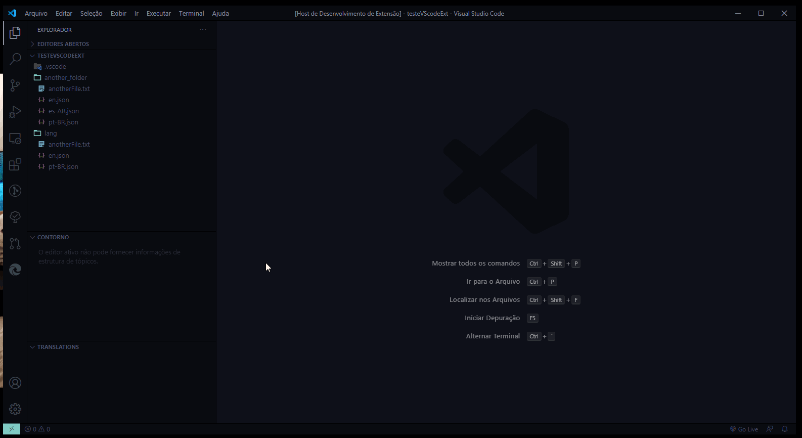
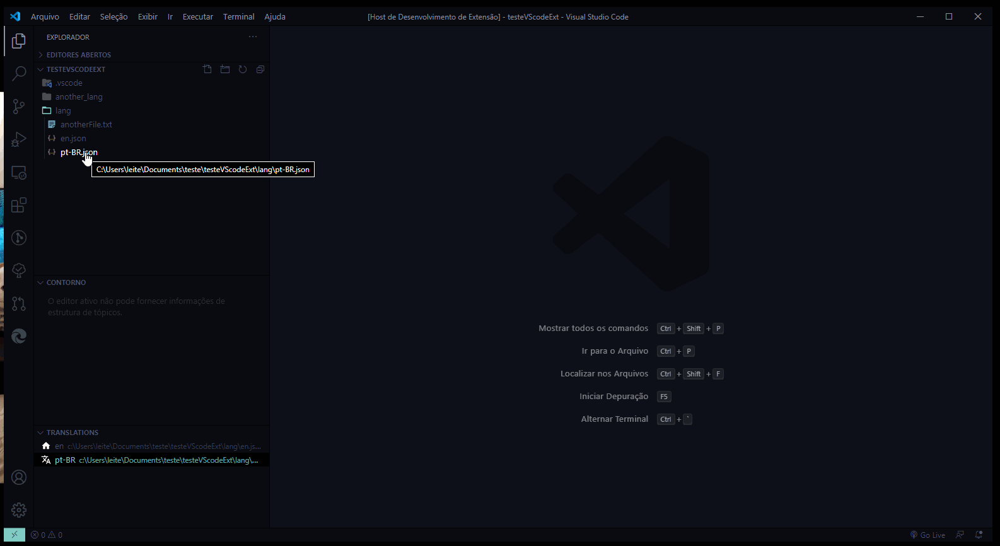
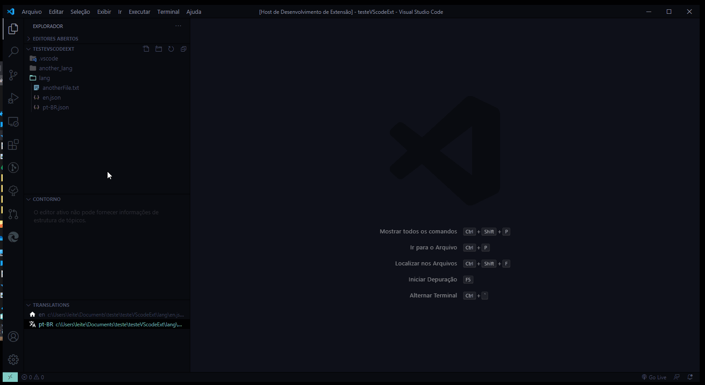
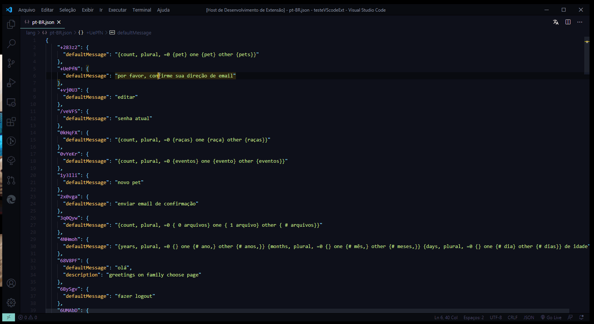

# react-intl-helper 

## Usage

### Set languages folder path and set default language
* Use the tree view on explorer sidebar to set the folder that contains your .json languages files.
* Right click on the language and click o set default lang to define your default language file
* Use the tree view to easy navigate to your translations files

### Open your translations files
When you open an file the extensios will check if the language have missing translations against the default language file then you can easly add the missing translations keys with or without defaultMessage

*Adding translations with defaultMessage*

*Adding translations with blank defaultMessage*

### Use the panel to view the message information
* Open an translation file
* Click on translation icon to open the translation panel
* Navigate through yours messages to see the default lang message

